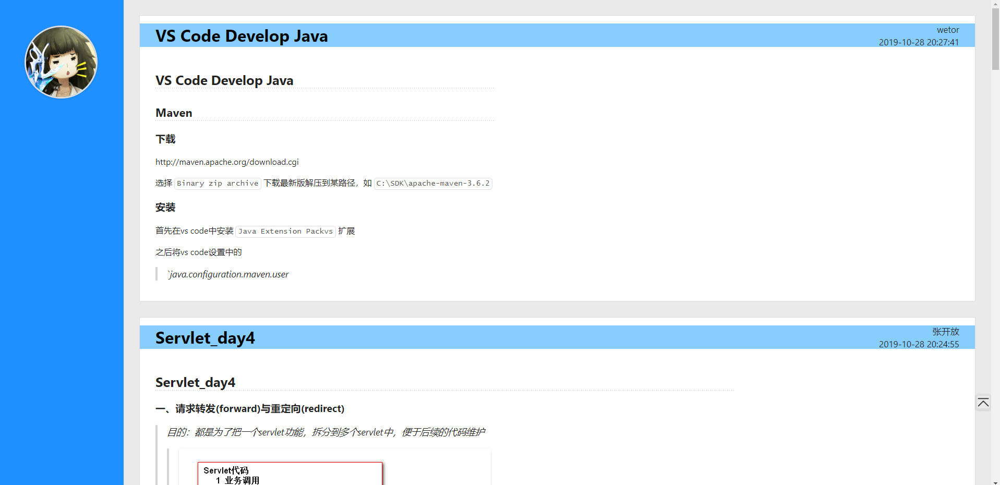
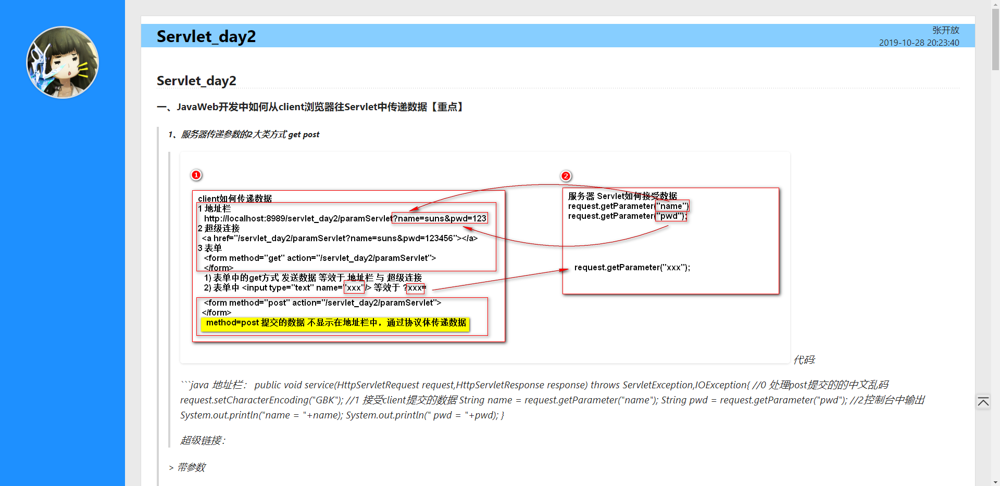
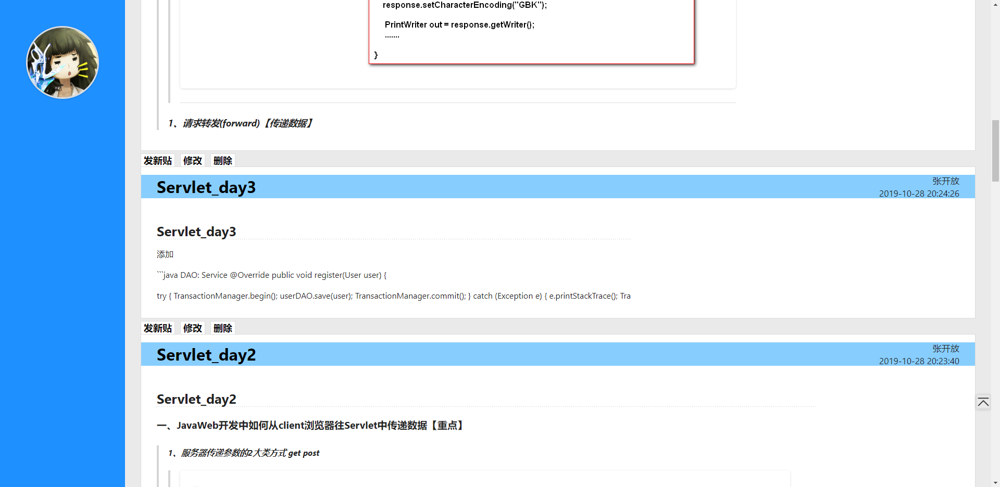
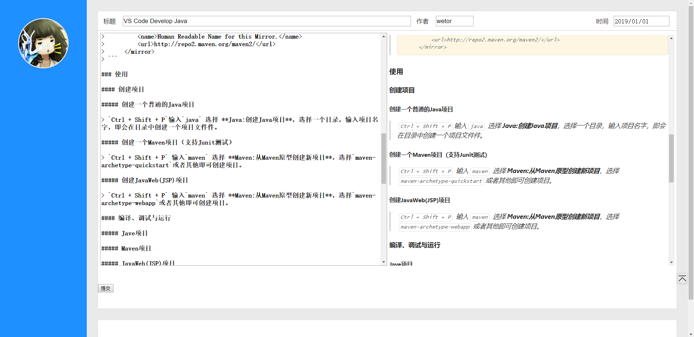

# JDBC_Servlet
a jdbc javaweb project  
第一个JavaWeb程序  
纯初学者，瞎写的一个博客，结构、代码混乱  
## 目前结构
servlet + JDBC
## 当前进度
### 后端
- JDBC的基本增、删、改、查、查全部
- 与前端配套的Servlet
- 超级简单的实现了需要登录才能操作操作帖子，零安全性
### 前端
- 主页、管理页的浏览、预览、查看帖子
- 管理页，相比主页支持删帖、发帖、修改等操作
- 发帖、修改贴支持MarkDown语法实时解析
- 操作完成提示页
- 其他(js)，返回顶部、滑动条同步、计时跳转
### 下一步
- 有待学习，会话，其他框架等...
### 截图
首页

查看帖子

管理员页面

发帖、编辑页面
